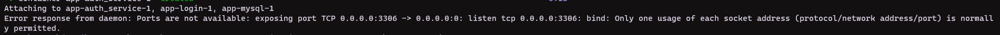

# motasemtree
Repo for assignment 1 for motasem's class

### New File Structure
Going forward all the dockerfiles will be in their respective sub directories. When you make the dockerfiles, add the configuration to the `docker-compose.yml.` 

The 'login' directory will contain **ALL** the web app pages, and functionality for them. The `app.py` within 'login' will contain all the functions and routes to go between the web apps. Other services can probably go within their own sub directories.

To build the images, containers, and network easily, cd into app and run:

```
docker compose up --build
```

To easily remove everything besides the images, run:

```
docker compose down -v
```

If you are running into this error with the port 3306 not being available for the MySQL container:



Ensure that no other docker containers are using port 3306 and that any local installation of MySQL or MariaDB is not running on your machine.

For some reason the analytics service container will exit upon creation, so you'll have to start it manually and it will run properly.